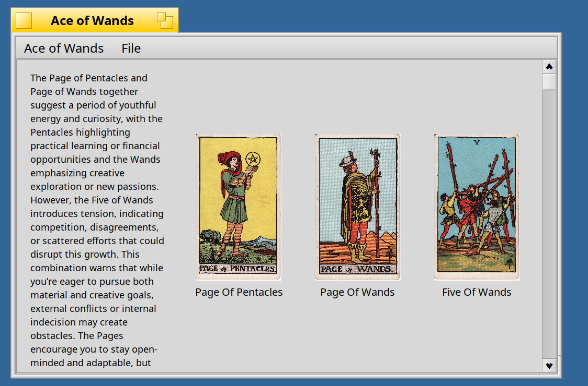

# Ace of Wands - Tarot Card Reading Application

## Overview
Ace of Wands is a desktop application for Haiku OS that provides tarot card readings. It allows users to draw a three-card spread, receive an AI-generated interpretation of the spread, and save/load readings.

Images are sourced from the [Internet Archive](https://archive.org/details/rider-waite-tarot/major_arcana_death.png) and are licensed as [CC Public Domain Mark 1.0 Universal](https://creativecommons.org/publicdomain/mark/1.0/). 

 

The application can optionally provide AI-powered interpretations using the DeepSeek API.

## Features
- **Three-Card Spread:** Draw a random three-card tarot spread.
- **Save/Load Readings:** Save your current reading (cards and interpretation) to a file and load previous readings.
- **Responsive User Interface:** The card display adjusts dynamically to the window size.

## Technology Stack
- **Language:** C++
- **Operating System:** Haiku OS
- **UI Framework:** Haiku's native BApplication, BWindow, BView classes.

## Architecture (Model-View-Presenter - MVP)
The application follows an MVP architectural pattern to separate concerns:

-   **`CardModel`:** Manages the application's data, including the set of available tarot cards, the current three-card spread, and methods for selecting and formatting card information. It loads card images as resources.
-   **`CardView`:** Responsible for the visual presentation of the application. It displays the tarot card images and the reading, handling layout and drawing operations.
-   **`CardPresenter`:** Acts as the intermediary between the `CardModel` and `CardView`. It contains the application's logic, orchestrating the process of drawing new cards and updating the view with the results.

## Key Components

-   **`App`:** The entry point of the application, responsible for initializing the Haiku application and creating the main window.
-   **`MainWindow`:** The primary window of the application. It contains the menu bar (for new readings, open, save, and quit actions) and the `CardView`. It also handles file input/output operations for saving and loading readings.
-   **`Reading`:** A class responsible for generating a basic interpretation of a given set of tarot cards.

## Setup and Usage

### Prerequisites
-   Haiku OS development environment.
-	You need the `curl` and `jsoncpp` headers. Install with `pkgman install curl_devel jsoncpp_devel`.

### Building the Application
The application can be built using the provided `Makefile`. Navigate to the project root directory in a Haiku terminal and run:

```bash
make
```

### Running the Application
Run the application from the project root:

```bash
./AceofWands
```

### How to Use
1.  **New Reading:** Select "File" -> "New Reading" from the menu bar to draw a new three-card spread.
2.  **Save Reading:** Select "File" -> "Save..." to save the current spread and its reading to a text file.
3.  **Open Reading:** Select "File" -> "Open..." to load a previously saved reading.

## Optional: AI-Powered Readings

This application can optionally provide AI-generated interpretations for your tarot spreads using the DeepSeek API. This feature is disabled by default.

### AI-Related Components
-   **`AIReading`:** A utility class that encapsulates the logic for communicating with the DeepSeek API. It constructs prompts based on the selected cards, sends requests, and parses the AI's response.
-   **`Config`:** A utility class for managing application configurations, specifically retrieving the DeepSeek API key from environment variables.

### Enabling the Feature
To enable AI-powered readings, you will need:
-   The `curl` and `jsoncpp` libraries (typically available in Haiku's package management).
-   A DeepSeek API key.

Before running the application, you must set your DeepSeek API key as an environment variable:

```bash
export DEEPSEEK_API_KEY="YOUR_DEEPSEEK_API_KEY"
```

Replace `"YOUR_DEEPSEEK_API_KEY"` with your actual DeepSeek API key.

When enabled, an AI-generated interpretation will appear below the cards after drawing a new spread.
